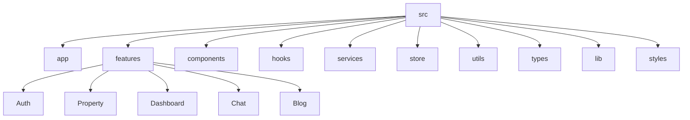

<div align="center">

# 🏠 Delta

### Modern Real Estate Platform

*A modern real estate platform for buying, selling, managing, and discovering properties with dedicated dashboards for buyers, sellers, and administrators.*

</div>

## 📑 Table of Contents

- [About](#user-content--about)
- [Highlights](#user-content--highlights)
- [Features](#user-content--features)
- [Tech Stack](#user-content--tech-stack)
- [Application Architecture](#user-content-️-application-architecture)
- [Screenshots](#user-content--screenshots)
- [Getting Started](#user-content--getting-started)
- [Project Structure](#user-content--project-structure)
- [Team](#user-content--team)

---
## 📖 About

**Delta** is a modern real estate platform developed by the **Nova Team** to simplify the process of buying, selling, and managing properties through a seamless and user-friendly experience.

The platform provides dedicated dashboards for buyers, sellers, and administrators, allowing each user to efficiently manage their activities within the system. Users can browse property listings, compare different options, save favorites, reserve property visits, communicate through real-time chat, and receive personalized notifications.

Built with modern web technologies such as **Next.js**, **TypeScript**, and **Tailwind CSS**, Delta focuses on performance, scalability, responsive design, and maintainable architecture. It also integrates interactive maps, AI-powered property price prediction, and secure authentication to deliver a complete real estate experience.
<br>

## ✨ Features

### 🏠 Property Management

* Browse and explore property listings
* Advanced property search and filtering
* Compare multiple properties
* Save favorite properties
* Reserve property visits
* Interactive property details

### 👤 User Experience

* Secure authentication with Email and Phone
* Personalized user profile
* Responsive design for all devices
* Real-time notifications
* Modern and intuitive user interface

### 💬 Communication

* Real-time chat between buyers and sellers
* Property reviews and ratings
* Questions and answers for each property

### 📍 Smart Features

* Interactive map integration
* Property location picker
* AI-powered property price prediction

### 📊 Dashboards

* Buyer Dashboard
* Seller Dashboard
* Admin Dashboard

### 📰 Additional Features

* Blog system
* Online payment workflow
* Property management tools
* Secure JWT authentication
  
<br>

## 🛠️ Tech Stack

| Category            | Technologies                      |
| ------------------- | --------------------------------- |
| ⚛️ Framework        | Next.js, React                    |
| 💻 Language         | TypeScript                        |
| 🎨 Styling          | Tailwind CSS, shadcn/ui, Radix UI |
| 📦 State Management | Zustand                           |
| 🔄 Data Fetching    | TanStack Query, Axios             |
| 🎬 Animation        | Framer Motion                     |
| 🗺️ Maps            | Neshan Map API                    |
| 🔐 Authentication   | JWT                               |
| 🚀 Deployment       | Vercel                            |

<br/>

## 📂 Project Structure

```text
src/
├── app/                  # App Router pages and layouts
├── components/           # Reusable UI components
├── features/             # Feature-based modules
├── hooks/                # Custom React hooks
├── lib/                  # Shared libraries and utilities
├── services/             # API services
├── store/                # Zustand stores
├── styles/               # Global styles
├── types/                # TypeScript type definitions
├── utils/                # Utility functions
└── assets/               # Static assets

public/
└── images/

docs/
└── screenshots/
```
<br/>
## 🏗️ Project Architecture


<br/>

## 📸 Screenshots

Explore the user interface of **Delta** through some of its main pages.

> 🚧 Screenshots will be added soon.

<br/>

## 🚀 Getting Started

Follow these steps to set up and run the project locally.

### Prerequisites

Make sure you have the following installed:

* Node.js (v18 or later)
* npm, yarn, pnpm, or bun
* Git

### Clone the Repository

```bash
git clone https://github.com/<username>/delta.git
cd delta
```

### Install Dependencies

```bash
npm install
```

### Configure Environment Variables

Create a `.env.local` file in the project root and add the required environment variables.

```env
# Example
NEXT_PUBLIC_API_URL=
```

### Start the Development Server

```bash
npm run dev
```

Open your browser and navigate to:

```text
http://localhost:3000
```

### Build for Production

```bash
npm run build
```

<br/>

## 🤝 Team

Nova was collaboratively developed by a team of developers as an educational software project.

The project reflects a collaborative effort in designing, implementing, and integrating different parts of a modern programming e-learning platform.

---
<div align="center">

Made with ❤️ by **Nova Team**

⭐ If you like this project, consider giving it a star on GitHub.

</div>


